# git 사용법
`Learn Git Branching`라는 게임을 바탕으로 git에 대한 간단한 사용법을 정리한 곳입니다!
***
## commit(커밋)
> 커밋은 Git 저장소에 여러분의 디렉토리에 있는 모든 파일에 대한 스냅샷을 기록하는 것입니다. 디렉토리 전체를 복사하여 붙여넣는것과 유사하지만, 훨씬 유용한 방법입니다!
### 중요 포인트!
커밋은 `매우 가볍고` 커밋 사이의 `전환도 매우 빠르다`는 것!
```
git commit
```

### 스냅샷이란?

* `변경된 내용`만 기록한다!
***
## branch(브랜치)
> 깃의 브랜치도 놀랍도록 가볍습니다. 브랜치는 특정 커밋에 대한 참조(reference)에 지나지 않습니다.
### 중요 포인트!
> 우선은, 단순히 브랜치를 "`하나의 커밋`과 그 `부모 커밋들을 포함하는 작업 내역`"이라고 기억
```
git branch newImage
```

```
git commit
```

### 왜 branch를 나누는가?
1. 다양한 유저가 동시에 프로젝트를 작성할 때 충돌을 막기 위해
2. 배포판, 다음 버전, 기능 추가, 이번 버전, 버그 수정 등 상황별로 대처
***
## checkout(체크업)
각 브랜치를 이동하기 위해선 다음 명령어를 사용해야 한다.
```
git checkout newImage
git commit
```

***
## merge(합치기)
> 두 별도의 브랜치를 합치는 몇가지 방법 중 하나!
> - ~~Git의 합치기(merge)는 두 개의 부모(parent)를 가리키는 특별한 커밋을 만들어 냅니다.~~
```
git merge bugFix
```
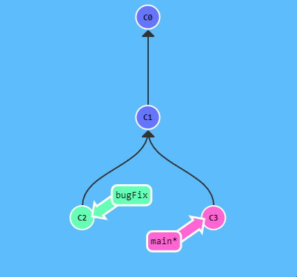
```
git checkout bugFix
git merge main
```
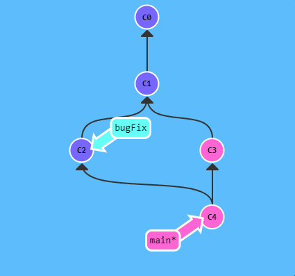
***
## rebase(리베이스)
> 리베이스는 기본적으로 커밋들을 모아서 복사한 뒤, 다른 곳에 떨궈 놓는 것
### 중요 포인트!
> 리베이스를 쓰면 저장소의 `커밋 로그와 이력이 한결 깨끗`
```
git rebase main
```
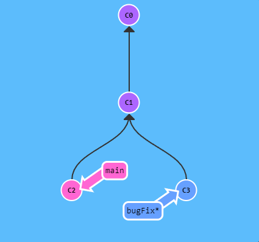
```
git rebase bugFix
```
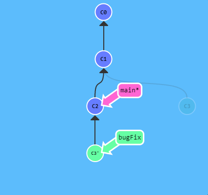
***
## HEAD
> HEAD는 현재 체크아웃된 커밋

각 커밋은 그것의 해시값으로 특정지을수 있습니다.
```
git checkout C1
git checkout main
git commit
git checkout C2
```

```
git checkout C1
```

* HEAD -> main -> C1 에서
* HEAD -> C1
***
## 상대 참조 ^
> 실제 해시값은 `fed2da64c0efc5293610bdd892f82a58e8cbc5d8`로 작성에 어려움이 있습니다.
> * Git은 똑똑하기 때문에 고유값을 나타낼 수 만큼 명시하면 됩니다!
* 해쉬로 접근하기 어렵기 때문에 `^`를 통해 한 단계 위로 이동이 가능합니다.
```
git checkout main^
```

```
git checkout C3
git checkout HEAD^
git checkout HEAD^
git checkout HEAD^
```

***
## 상대 참조 ~
동일한 코드를 연속으로 사용하는 것 보다 수치로 나타내는 것이 더 직관적입니다
```
git checkout HEAD~4
```
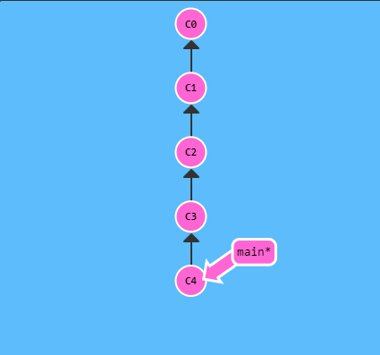
***
## 브랜치 강제로 옮기기
[branch](#branch브랜치)에 -f 옵션을 통해 커밋을 직접적으로 재지정할 수 있습니다.
```
git branch -f main HEAD~3
```
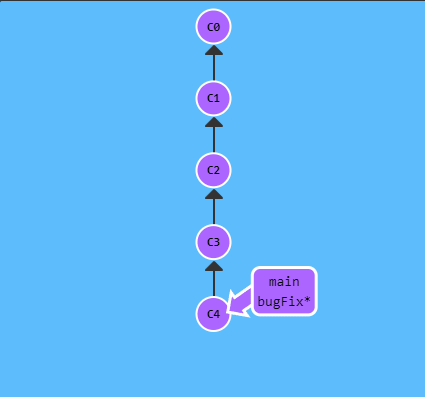
* 실제로 vim을 사용하여 설정합니다.
* 또한 pick 설정을 통해 제거하거나, 순서도 변경 가능합니다.

***
## reset
> 브랜치로 하여금 예전의 커밋을 가리키도록 이동시키는 방식
```
git reset HEAD^
```
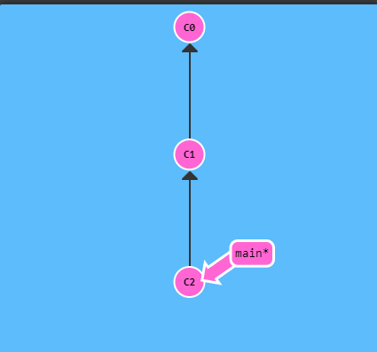
> "히스토리를 고쳐쓴다"는 점 때문에 다른 사람이 작업하는 리모트 브랜치에는 쓸 수 없습니다.
***
## revert
```
git revert HEAD
```
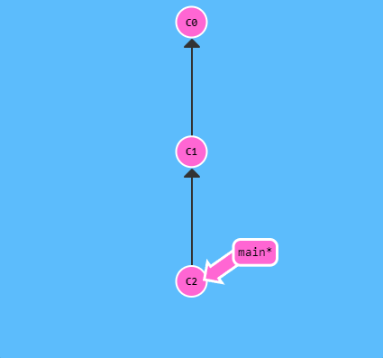
* 이를 통해 다른 작업자의 작업에 문제를 생기지 않는다
***
## cherry-pick
> 현재 위치(HEAD) 아래에 있는 일련의 커밋들에대한 복사본을 만들겠다는 것을 간단히 줄인 말
```
git cherry-pick C2 C4
```
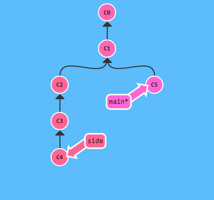
***
## interactive rebase(인터렉티브 리베이스)
> 원하는 커밋을 모르는 상황에는 어쩌죠? 고맙게도 git은 이런상황에 대한 대안이 있습니다.
[rebase](#rebase리베이스)에서 -i 옵션을 사용하는 것!
> * 적용할 커밋들의 순서를 UI를 통해 바꿀수 있습니다(여기서는 마우스 드래그앤 드롭으로 가능합니다)
> * 원하지 않는 커밋들을 뺄 수 있습니다. 이것은 pick을 이용해 지정할 수 있습니다(여기서는 pick토글 버튼을 끄는것으로 가능합니다)
> * 마지막으로, 커밋을 스쿼시(squash)할 수 있습니다. 불행히도 저희 레벨은 몇개의 논리적 문제들 때문에 지원을 하지 않습니다. 이거에 대해서는 넘어가겠습니다. 요약하자면 커밋을 합칠 수 있습니다
```
git rebase -i HEAD~4
```
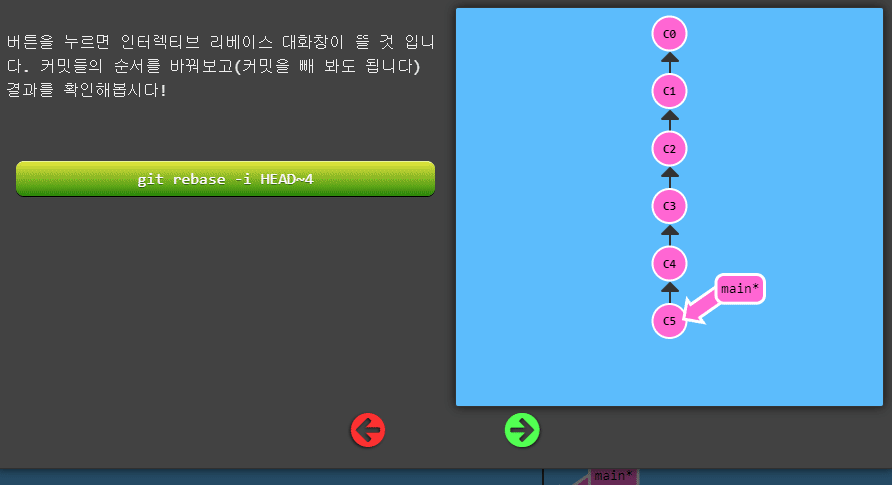
***
## tag
> 브랜치는 쉽게 변하며 임시적인 것입니다
> * 중요한 지점들에 영구적으로 표시를 할 방법
```
git tag v1 C1
```
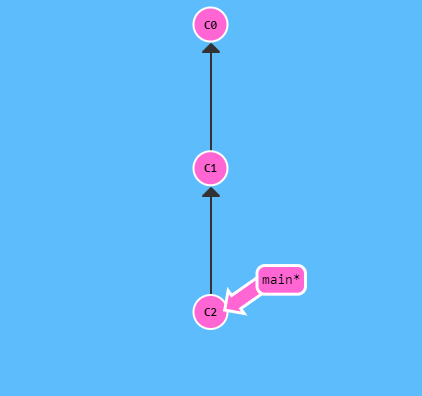
* 만약에 커밋을 
***
## describe
> 가장 가까운 "닻(태그)"에 비해 상대적으로 어디에 위치해있는지 **describe(묘사)** 해주는 명령어
```
git tag v2 C3
```
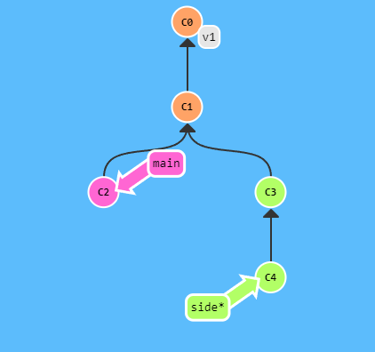
```
git describe main
```
* v1_2_gC2
```
git describe
```
* v2_1_gC4

***
## 상대 참조 ^ + 숫자
[상대 참조 ^](#상대-참조)의 ^ 뒤에 숫자를 붙이면 부모를 선택할 수 있습니다!
```
git checkout main^2
```

```
git checkout HEAD~
git checkout HEAD^2
git checkout HEAD~2
```
```
git checkout HEAD~^2~2
```


***
# 원격 관리
> 원격 저장소는 수많은 장점
> 1. 격 저장소는 백업으로서의 역할을 훌륭하게 수행
> 2. 원격 저장소를 통해 코딩을 다른 사람들과 함께 할 수 있다는 것
## clone
> git clone은 원격 저장소의 복사본을 _로컬_에 생성할때 사용하는 명령어
```
git clone
```
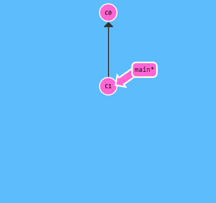
## o/main
> 원격 브랜치 또한 (필수적인) 이름짓기 규약이 있습니다
> - `<remote name>/<branch name>`
> - 보통 `o`는 `origin`으로 표시됩니다.
```
git checkout o/main
git commit
```
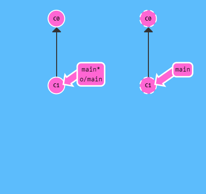
* 원격 브랜치에서 내용을 수정할 때에는 브렌치가 **이동하지 않습니다!**
## fetch
> 원격 저장소_에서_ 데이터를 가져오는 방법을 배워볼 것
```
git fetch
```
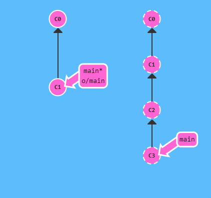
> `git fetch`는 두가지의 중요한 단계를 수행합니다!
> * 원격 저장소에는 있지만 로컬에는 없는 커밋들을 다운로드
> * 원격 브랜치가 가리키는곳을 업데이트
> 
> 로컬에 원격 저장소의 상태를 동기화하는 것이 목적
> 
> **로컬 상태를 변경하지 않습니다!**
***
## pull
> 원격 저장소의 변경을 fetch하고 그이후에 merge하는 작업의 과정이 워낙 자주있는 일
> - 두가지를 한번에 하는 명령을 제공 `git pull`
```
git fetch
git merge o/main
```

```
git pull
```

## fakeTeamwork
> 원격 저장소에서 일어난 변경들을 어떻게 로컬로 가져올것인지
> * 불가피하게 그 _변경_들을 만들어야 되는데 사용하는 명령어
```
git fakeTeamwork
```

```
git fakeTeamwork foo 3
```
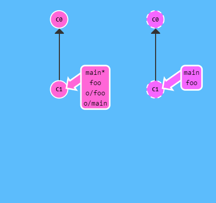
***
## push
> 작업을 업로드해 공유하는것
```
git push
```
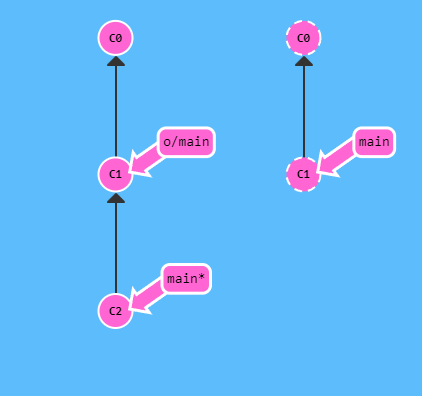
***
## 히스토리가 엇갈릴 때
> 구버전 기준으로 코딩을 작성 했을 때 충돌이 발생할 수 있음(같은 변수 사용 등)
```
git push
```
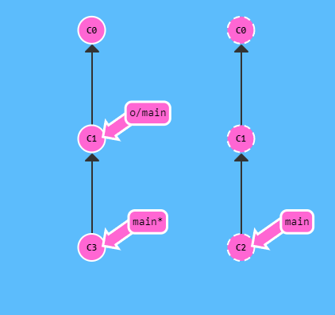
### 해결방법
**rebase**
```
git fetch
git rebase o/main
git push
```

* 조금 더 간결하게
```
git pull --rebase
git push
```

**merge**
```
git fetch
git merge o/main
git push
```


* 조금더 간결하게
```
git pull
git push
```
***
## 원격 저장소 거부(remote rejected)
> 규모가 큰 개발팀에서 일하는 경우, 보통 원격저장소의 main 브랜치는 잠겨있습니다(locked).
>
> 변경사항을 적용하려면 pull request 과정을 거쳐야하죠
>
> `! [remote rejected] main -> main (TF402455: Pushes to this branch are not permitted; you must use a pull request to update this branch.)`
```
git branch feature
git reset HEAD^
git checkout feature
git push
```
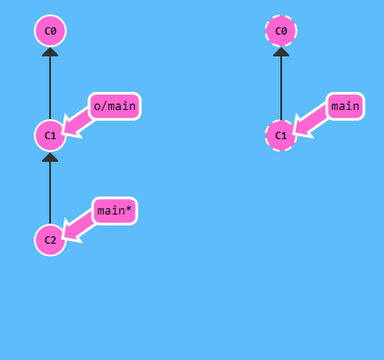
***
## 원격 추적
> `totallyNotMain`라는 브랜치에서 `git push`를 수행해서 원격 저장소의 브랜치 `main`로 작업을 push할 수 있습니다!
### 사용법
**checkout**
```
git checkout -b foo o/main
git pull
```
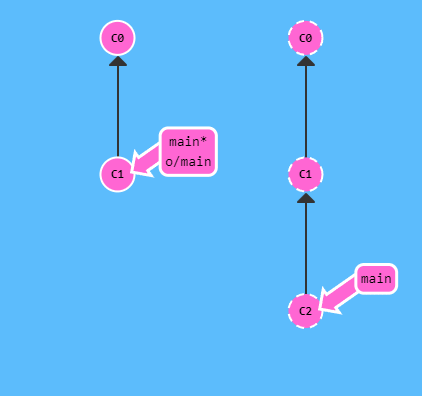
```
git checkout -b foo o/main
git commit
git push
```


**branch**
```
git branch -u o/main foo
git commit
git push
```
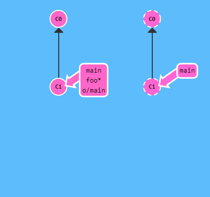
***
## push 심화
> [push](#push)는 다음 형식으로 인자를 사용할 수 있습니다. `git push <remote> <place>`
>
> `git push origin main` 해석
> - main이라는 브랜치에서 모든 커밋을 수집
> - origin의 main 브랜치로 가서 부족한 커밋을 채워 넣음
```
git checkout C0
git push origin main
```

```
git checkout C0
git push
```

***
## place 세부 사항
> 커밋의 근원이 되는 소스와 목적지가 되는 인자를 넣어서 작성이 가능함`git push origin <source>:<destination>`
```
git push origin foo^:main
```
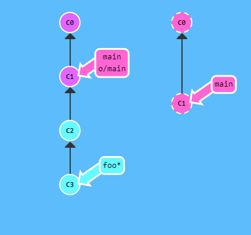
```
git push origin main:newBranch
```
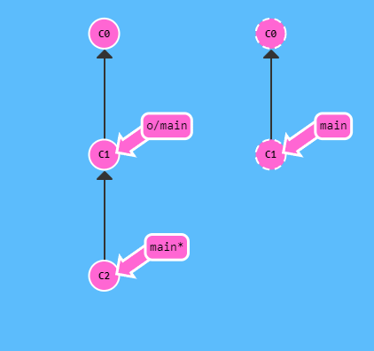
* 목적지가 없으면 만들어짐!

***
## fetch 인자들
```
git fetch origin foo
```
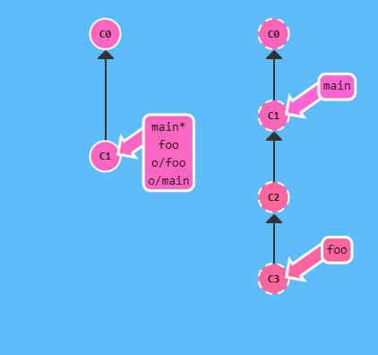
```
git fetch origin foo~1:bar
```
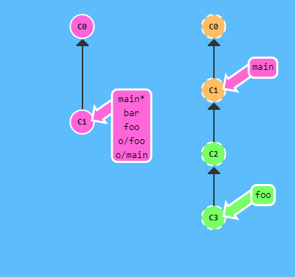
```
git fetch origin foo~1:bar
```
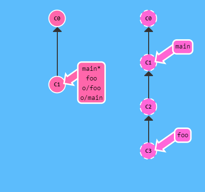
***
## source의 이상함
> spurce를 안 사용하면?
```
git push origin :foo
```
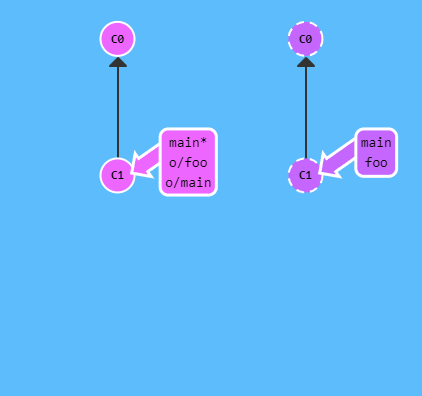
```
git fetch origin :bar
```
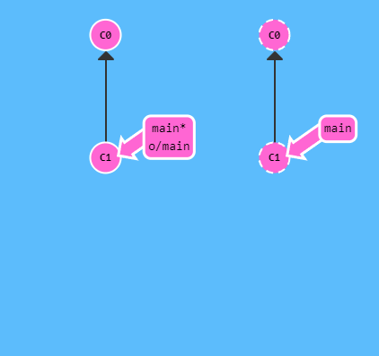

***
## pull 인자들

***
## 참고 링크
|날짜|제목(링크)|내용|
|:-:|:-:|:-:|
||[Learn Git Branching](https://learngitbranching.js.org/?locale=ko)|참고한 git 게임|
||[누구나 쉽게 이해할 수 있는 Git 입문](https://backlog.com/git-tutorial/kr/stepup/stepup1_1.html)|git에 대한 간단한 설명서