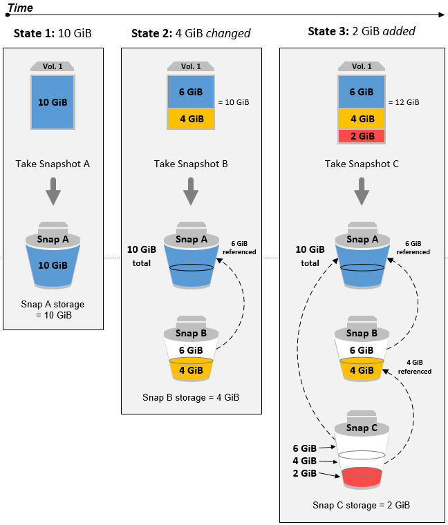
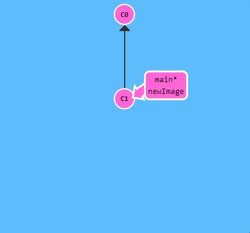

# git 사용법
`Learn Git Branching`라는 게임을 바탕으로 git에 대한 간단한 사용법을 정리한 곳입니다!
***
## commit(커밋)
> 커밋은 Git 저장소에 여러분의 디렉토리에 있는 모든 파일에 대한 스냅샷을 기록하는 것입니다. 디렉토리 전체를 복사하여 붙여넣는것과 유사하지만, 훨씬 유용한 방법입니다!
### 중요 포인트!
커밋은 `매우 가볍고` 커밋 사이의 `전환도 매우 빠르다`는 것!
```
git commit
```

### 스냅샷이란?

* `변경된 내용`만 기록한다!
***
## branch(브랜치)
> 깃의 브랜치도 놀랍도록 가볍습니다. 브랜치는 특정 커밋에 대한 참조(reference)에 지나지 않습니다.
### 중요 포인트!
우선은, 단순히 브랜치를 "`하나의 커밋`과 그 `부모 커밋들을 포함하는 작업 내역`"이라고 기억
```
git branch newImage
```

```
git commit
```

### 왜 branch를 나누는가?

***
## checkout(체크업)
각 브랜치를 이동하기 위해선 다음 명령어를 사용해야 한다.
```
git checkout newImage
git commit
```

***
## cherry-pick
***
## reset
***
## revert
***
## rebase
***
## merge
***
## 관련 링크
|날짜|제목(링크)|내용|
|:-:|:-:|:-:|
||[Learn Git Branching](https://learngitbranching.js.org/?locale=ko)|참고한 git 게임|
||[누구나 쉽게 이해할 수 있는 Git 입문](https://backlog.com/git-tutorial/kr/stepup/stepup1_1.html)|git에 대한 간단한 설명서